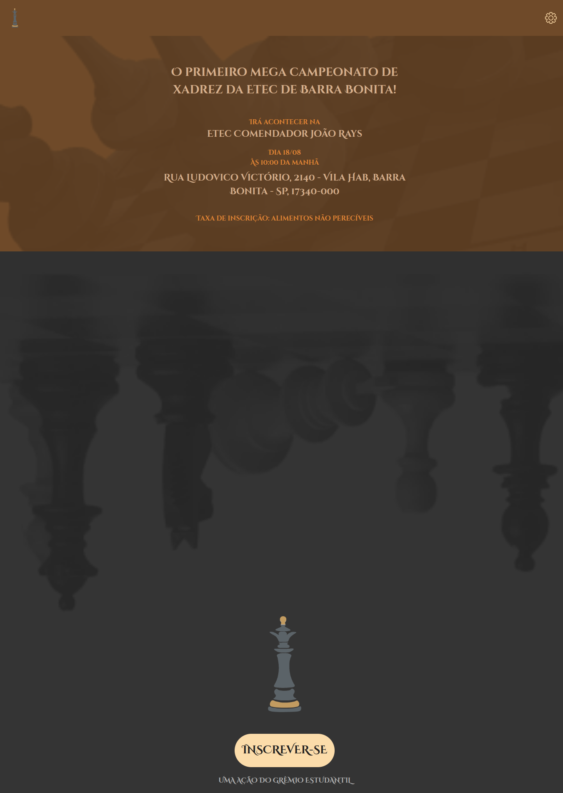
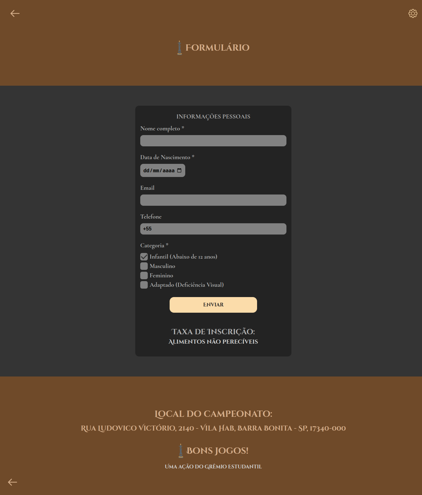

<h1 align="center">XadrezEtec</h1>

  

<h3 align="center">Projeto desenvolvido durante as aulas de Acessibilidade Digital do 2º bimestre do 3º módulo do curso: Ensino Médio com Habilitação Profissional de Técnico em Informática para Internet. Professor: Edriano Campana.<h3>

 

## Tópicos
- [Imagens do projeto](#img)
- [Acesso ao projeto](#acesso)
- [Objetivos e Descrição](#desc)
- [Tecnologias utilizadas](#tec)
- [Status do projeto](#status)  
- [Membros do grupo](#membros)
- [Licença](#license)

 

<h2 id="img">🖥️ Imagens do projeto</h2>

  
  

 

<h2 id="acesso">🔗 Acesso ao projeto</h2>

Clique [aqui](https://fel1324.github.io/XadrezEtec/) para acessar o projeto!

 

<h2 id="desc">💻 Objetivos e Descrição</h2>

  O projeto foi desenvolvido com o objetivo de implementar pelo menos uma técnica de acessibilidade digital. O grupo optou por criar uma funcionalidade que permite aumentar e diminuir o tamanho da fonte da página.

  O projeto consiste em um site com duas páginas. A primeira promove um campeonato fictício de xadrez, que seria realizado na ETEC Comendador João Rays, localizada em Barra Bonita-SP, apresentando informações relevantes sobre o evento. A segunda disponibiliza um formulário de inscrição, permitindo que os interessados se cadastrem para participar do campeonato anunciado.

 

<h2 id="tec">🤖 Tecnologias utilizadas</h2>

* HTML e CSS
* Javascript
* Git e Github

 

<h2 id="status">⌛ Status do projeto</h2>

✔️ Projeto Finalizado

 

<h2 id="membros">🧑‍🤝‍🧑 Membros do grupo</h2>

* Desenvolvedor Front-End: [Matheus Nunes Bertolini](https://github.com/Matheus-Bertolini)
* Desenvolvedor Front-End: [Rafael Roberto de Oliveira](https://github.com/Fel1324)
* Designer: [Rafaela Alessandra Torelli](https://github.com/RafaelaAT)

 

<h2 id="license">📝 Licença</h2>

Todo esse trabalho está sob a licença MIT.